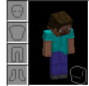

<h1 align="center">Bean's Backpacks </h1>
If your crush has ever pointed and laughed while they said to you, "Ew. is that inventory clutter? 
Omg that's so embarrassing!" Then you've come to the right place!

<h3> Introducing Bean's Backpacks!  </h3>

Babe wake up! A new slot just dropped! Opening your inventory you'll find the 
new "Back Slot". Placing a backpack there you can store items directly into 
it and displays it for other players to see. Hold sprint + right-click on a block
to place it into the world and to pick it up again.

Storage in these backpacks are limited by the total number of Items, similar to 
bundles. Leather backpacks can hold up to 256 unique items (4 Stacks). Iron 
and Gold hold up to 576 items (9 Stacks).

<h2 align="center">Show Your True Colors! </h2>

Leather Backpacks can be dyed any color you can imagine and Iron and Gold Backpacks
can be trimmed with anything you get your hands on.

<h3 align="center"> Crafting / Smithing </h3>

<h3> Pots </h3>

Equipping a Decorated Pot gives you unlimited storage of a single item. Great for 
transporting items from a farm or quarry! Pots cannot be unequipped or placed while 
there are items inside.    
Decorate the pot to show everyone what you're carrying. Sherds made with the 
decorated pot display on your back. Tell a story!

<h3> On Death</h3>
Backpacks drop as if you placed them at your feet.
If you are wearing a Pot, all of it's items drop on the floor as long as they 
stack to 64.

>⚠️ If you die with a pot, items that do not stack to 64 such as Lava Buckets and Ender Pearls will get deleted after spawning 72+ stacks.

<h2> FEEDBACK </h2>
<a href="https://github.com/BeansGalaxy/galaxybackpacks/labels/bug">Bug Fix </a>
&nbsp; • &nbsp;
<a href="https://github.com/BeansGalaxy/galaxybackpacks/labels/enhancement">Suggestions </a>

